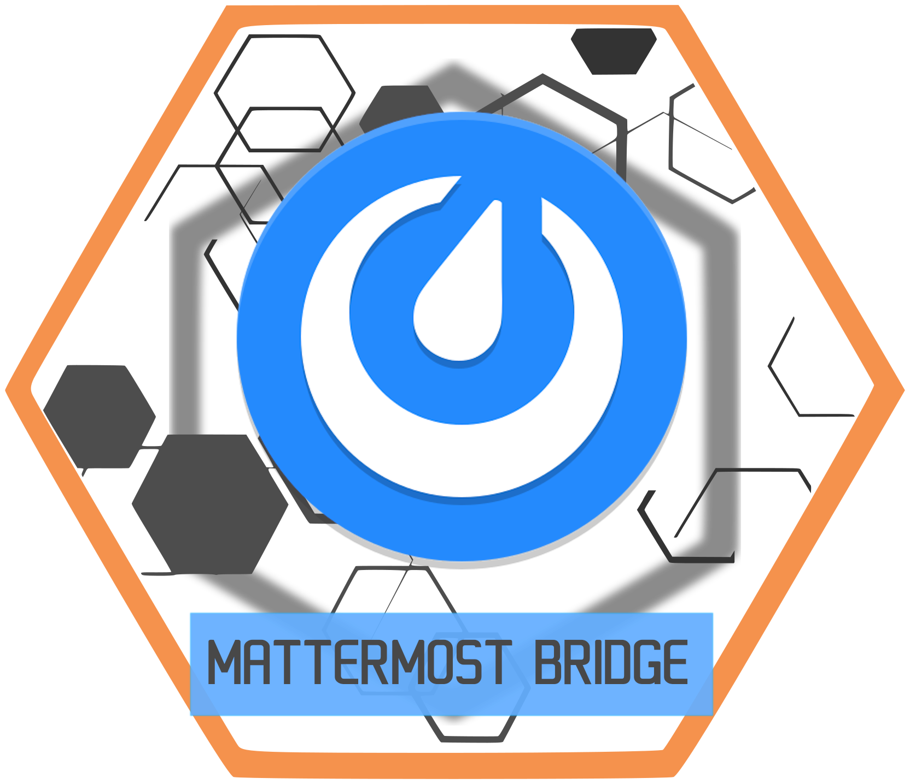
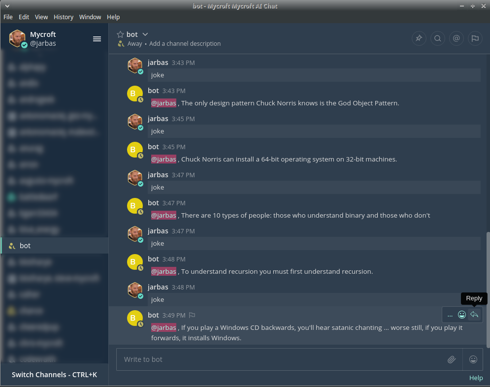

# HiveMind Mattermost Bridge

Relay a [Mattermost](https://mattermost.com) bot account to a [HiveMind](https://github.com/JarbasHiveMind/HiveMind-core) hub.

The bridge is a HiveMind **satellite** whose input and output are Mattermost chat instead of a microphone. Mentions and direct messages to the bot become utterances sent to the hub; the hub's spoken reply is posted back to the originating channel. Any HiveMind hub (and the OVOS skills behind it) becomes reachable as a Mattermost chatbot.

```
Mattermost channel  ⇄  HiveMind_mattermost_bridge  ⇄  HiveMind hub  ⇄  OVOS skills
```




## Prerequisites

- A running **HiveMind hub** ([hivemind-core](https://github.com/JarbasHiveMind/HiveMind-core)) reachable over the network, and a **HiveMind access key** for this bridge (`hivemind-core add-client`).
- A **Mattermost server** and a **bot user account** on it (an email/login and password the bridge logs in with). The bot must be a member of the channels it should answer in.
- Python 3.10+.

## Install

```bash
git clone https://github.com/JarbasHiveMind/HiveMind_mattermost_bridge
cd HiveMind_mattermost_bridge
pip install .
```

This installs the `hivemind-mattermost-bridge` console script.

Dependencies: `hivemind-bus-client`, `mattermostdriver`, `ovos-utils`, `ovos-bus-client`.

## Quickstart

**1. Register the bridge on the hub** (where `hivemind-core` is installed):

```bash
hivemind-core add-client --name mattermost-bridge \
  --access-key "your-access-key" --password "your-password"
```

A new client is registered but mute: the hub denies every message type until you whitelist it. Do this next, or the bridge will connect and never answer:

```bash
hivemind-core allow-msg recognizer_loop:utterance mattermost-bridge
hivemind-core allow-msg speak mattermost-bridge
```

If you run more than one bridge on the same host, give each its own `hivemind-client set-identity` credentials. Bridges sharing an identity share a Noise session pin, and the hub treats reconnects from either as the same client, breaking encryption for both.

**2. Run the bridge.** Pass Mattermost credentials and HiveMind identity as flags (HiveMind key/password/host default to the values stored by `hivemind-client set-identity`):

```bash
hivemind-mattermost-bridge \
  --mail bot@example.com \
  --pswd bot-password \
  --url chat.example.com \
  --tag @bot \
  --host ws://127.0.0.1 \
  --port 5678 \
  --key your-access-key \
  --password your-hivemind-password
```

Or run as a module: `python -m mattermost_bridge --help`.

**3. Send a message.** In a channel the bot is in, mention it:

```
@bot what time is it?
```

The bridge forwards the message to the hub and posts the hub's reply back to the channel.

## Configuration

CLI flags (`hivemind-mattermost-bridge --help`):

| Flag | Description | Default |
| --- | --- | --- |
| `--mail` | Mattermost bot account login (email) | — |
| `--pswd` | Mattermost bot account password | — |
| `--url` | Mattermost server host (no scheme) | — |
| `--tag` | Trigger tag; messages containing one are forwarded (repeatable) | `@bot` |
| `--host` | HiveMind hub host (e.g. `ws://127.0.0.1`) | from identity file |
| `--port` | HiveMind hub port | `5678` |
| `--key` | HiveMind access key | from identity file |
| `--password` | HiveMind password | from identity file |
| `--self-signed` | Accept self-signed SSL certificates | off |
| `--lang` | Utterance language | `en-us` |

## Troubleshooting

- **Bot never answers** — confirm the bot account is a member of the channel and the message contains a trigger tag; confirm the hub is reachable and the access key is registered (`hivemind-core list-clients`).
- **Mattermost login fails** — check `url` is the bare host (no `https://`) and the bot login/password are correct.
- **No reply posted** — replies are routed by channel and user context; the hub must echo those context keys and produce a `speak` for the answer to land.
- **Bridge connects but never replies** — the client is registered but not whitelisted. Run `hivemind-core allow-msg recognizer_loop:utterance mattermost-bridge` and `hivemind-core allow-msg speak mattermost-bridge` on the hub.
- **`invalid api key` at connect time** — the hub rejected the handshake, usually because the bridge or `hivemind-bus-client` is older than the hub. Upgrade the bridge.
- **"reconnect worker already running" in the log** — a known issue in older `hivemind-bus-client` releases when a dropped connection retries overlap. Fixed upstream; upgrade `hivemind-bus-client` and the bridge.
- **Handshake fails after the hub was reinstalled or the client's key changed** — the bridge is holding a stale Noise session pin. Clear it on the hub with `hivemind-core reset-noise-pin mattermost-bridge` and restart the bridge.

## Documentation

- **[Operator setup](docs/operator-setup.md)** — getting the bot's Mattermost account (or self-hosting `mattermost-preview`), registering the bridge on a HiveMind hub, the run command, and live e2e.

See also [`docs/`](docs/) for a full setup walkthrough, a configuration reference, and worked examples.
